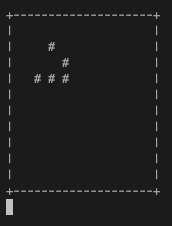

# Conway

Implement Conway's Game of Life: [Wikipedia](https://en.wikipedia.org/wiki/Conway%27s_Game_of_Life)

You don't need anything fancy, you can just animate this in the terminal:

### Some tips:

Define a field a 2D-list of strings:

    o = " " # off
    X = "#" # on

    field = [
        [o, o, o, o, o, o, o, o, o, o],
        [o, X, o, o, o, o, o, o, o, o],
        [o, o, X, X, o, o, o, o, o, o],
        [o, X, X, o, o, o, o, o, o, o],
        [o, o, o, o, o, o, o, o, o, o],
        [o, o, o, o, o, o, o, o, o, o],
        [o, o, o, o, o, o, o, o, o, o],
        [o, o, o, o, o, o, o, o, o, o],
        [o, o, o, o, o, o, o, o, o, o],
        [o, o, o, o, o, o, o, o, o, o],
    ]

Print the field with a space between each element to make it (sort of) square.

Use this to clear the screen between frames:

    ### clear screen
    print(chr(27) + "[2J")

Use the time library to pauze between frames:

    import time
		time.sleep(0.1)
